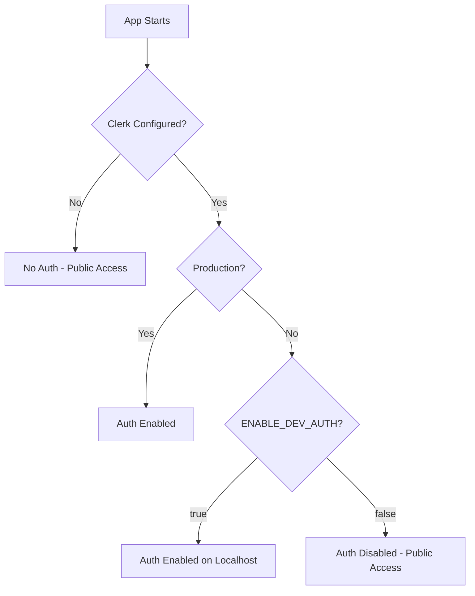

# Authentication Configuration Guide

## Overview

The Recipe Manager application uses Clerk for authentication with a flexible configuration that allows:
- **Development without authentication** - Work locally without Clerk setup
- **Testing authentication locally** - Enable auth on localhost when needed
- **Production authentication** - Always enabled when Clerk is configured

## Quick Start

### Option 1: Run Without Authentication (Default)
No configuration needed! The app works out of the box without authentication.

```bash
npm run dev
```

### Option 2: Enable Authentication on Localhost

1. **Set up Clerk keys** in `.env.local`:
```env
NEXT_PUBLIC_CLERK_PUBLISHABLE_KEY=your_publishable_key
CLERK_SECRET_KEY=your_secret_key
ENABLE_DEV_AUTH=true  # This enables auth on localhost
```

2. **Validate configuration**:
```bash
npm run auth:validate
```

3. **Start the app**:
```bash
npm run dev
```

## Configuration Details

### Environment Variables

| Variable | Required | Description |
|----------|----------|-------------|
| `NEXT_PUBLIC_CLERK_PUBLISHABLE_KEY` | No* | Clerk publishable key (starts with `pk_`) |
| `CLERK_SECRET_KEY` | No* | Clerk secret key (starts with `sk_`) |
| `ENABLE_DEV_AUTH` | No | Set to `true` to enable auth on localhost |
| `NEXT_PUBLIC_APP_URL` | No | Your app URL (defaults to http://localhost:3004) |

*Required only if you want authentication features

### How Authentication Works

The authentication system has three modes:

1. **No Authentication** (Default)
   - When Clerk keys are not configured
   - All features are publicly accessible
   - Perfect for local development

2. **Development with Authentication**
   - When Clerk keys are configured AND `ENABLE_DEV_AUTH=true`
   - Full authentication on localhost
   - Test auth flows before deploying

3. **Production Authentication**
   - Automatically enabled when `NODE_ENV=production` and Clerk is configured
   - No need for `ENABLE_DEV_AUTH` flag
   - Always enforces authentication

### Authentication Flow



## Validation Tools

### Check Configuration
Run the validation script to check your setup:

```bash
npm run auth:validate
```

This will show:
- Current configuration status
- Any errors or warnings
- Recommendations for your setup

### Debug Endpoint
Visit the debug endpoint to see your configuration:

```
http://localhost:3004/api/debug-clerk
```

## Common Scenarios

### Scenario 1: Local Development Without Auth
**Use Case**: Building features, don't need authentication

```env
# Just run the app, no config needed
npm run dev
```

### Scenario 2: Testing Authentication Locally
**Use Case**: Testing login flows, protected routes

```env
# .env.local
NEXT_PUBLIC_CLERK_PUBLISHABLE_KEY=pk_test_...
CLERK_SECRET_KEY=sk_test_...
ENABLE_DEV_AUTH=true
```

```bash
npm run auth:validate  # Check configuration
npm run dev           # Start with auth enabled
```

### Scenario 3: Production Deployment
**Use Case**: Deploying to Vercel/production

```env
# Production environment variables
NEXT_PUBLIC_CLERK_PUBLISHABLE_KEY=pk_live_...
CLERK_SECRET_KEY=sk_live_...
NODE_ENV=production
# No ENABLE_DEV_AUTH needed - auto-enabled in production
```

## Troubleshooting

### Authentication Not Working on Localhost

1. **Check if Clerk keys are set**:
```bash
npm run auth:validate
```

2. **Ensure ENABLE_DEV_AUTH is true**:
```env
ENABLE_DEV_AUTH=true
```

3. **Restart the development server**:
```bash
npm run dev
```

### "Publishable key not valid" Error

This means:
- Keys have trailing characters or spaces
- Keys are malformed or incomplete
- Wrong environment keys (test vs live)

**Solution**:
1. Copy keys directly from Clerk Dashboard
2. Remove any trailing spaces or special characters
3. Ensure test keys for development, live keys for production

### Authentication Works But No Sign-In Button

This happens when:
- Clerk is configured but Google OAuth is not set up
- SSO connections are not enabled in Clerk Dashboard

**Solution**:
1. Go to Clerk Dashboard → SSO Connections
2. Enable Google OAuth
3. Add Google Client ID and Secret

## Security Best Practices

1. **Never commit `.env.local`** - Contains sensitive keys
2. **Use test keys for development** - Keys starting with `pk_test_` and `sk_test_`
3. **Use live keys for production** - Keys starting with `pk_live_` and `sk_live_`
4. **Validate before deploying** - Run `npm run auth:validate`
5. **Keep ENABLE_DEV_AUTH false in production** - It's only for localhost testing

## API Reference

### Auth Configuration Module
```typescript
import { isClerkConfigured, isAuthEnabled } from '@/lib/auth-config';

// Check if Clerk keys are configured
const hasClerk = isClerkConfigured();

// Check if authentication is currently enabled
const authActive = isAuthEnabled();
```

### Auth Validation
```typescript
import { validateAuthConfig } from '@/lib/auth-config';

const { isValid, errors, warnings } = validateAuthConfig();
```

## Need Help?

- Run `npm run auth:validate` to check your setup
- Visit `/api/debug-clerk` for configuration details
- Check the [Clerk Documentation](https://clerk.com/docs)
- Review `.env.example` for all configuration options